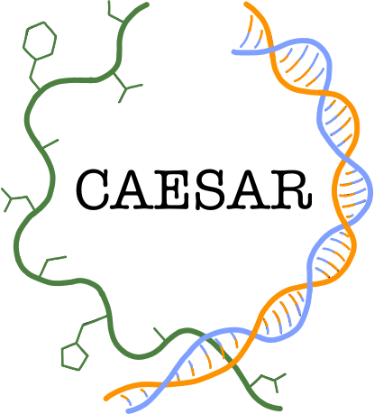

<!--  -->
<!-- center and resize the image with html syntax -->
<p align="center">
  
</p>

# CAndidate Enzyme SeARch

CAESAR is a pipeline to (1) search candidates sequences, based on references sequences or hmm pattern, (2) clustered them, (3) selects candidates in each clusters and (4) build a phylogenetic tree.

## Installation

Simply donwload ZIP or clone the repository to obtain the code.

Then you can install all the Python dependencies and all the external bioinformatics tools required with the following command*:

```
conda env create -n caesar -f caesar_env.yml
```
*mamba can be used instead of conda

This will install:
- Python package
  - biopython
  - pyyaml
  - requests
  - psutil
- Bioinformatic tools
  - diamond>=2.1.0
  - seqkit>=2.8.0
  - hmmer
  - mafft
  - fasttree

## Configuration file

CAESAR will always ask you to provide a file in yaml format. This file must contains some information like the databases paths, e.g:

```yaml
trembl_db:
    - dmnd: "/home/user/trembl.dmnd"
    - faa: "/home/user/trembl.fasta"
nr_db:
    - dmnd: "/home/user/nr.dmnd"
    - faa: "/home/user/nr.fasta"
other_db:
    - dmnd: "/home/user/other.dmnd"
    - faa: "/home/user/other.faa"  # amino acid sequences in fasta format
    - fna: "/home/user/other.fna"  # nucleic acid sequences in fasta format
strain_library: "/home/user/strain_library.tsv"
candidate_selection:
    - strain_library
    - order  # strain available in the ATCC or DSM collection
    - other
slurm: 1  # 0: false 1: true
parallel: 1  # 0: false 1: true
module:  # if the system use module to load software...
    - diamond/2.1.2
    - hmmer/3.4
```

All the `name_db` key correspond to a database, the `dmnd` format is required to use the blastp of diamond, the `faa` format is required to use hmmsearch. For the uniprot or nr database, only one of them is necessary. For other database, theses two format is required to use blastp, but only the `faa` if you used hmmsearch. For CAESAR to be able to provide the nucleic sequences of the candidates, the sequences (`fna`) must also be provided (for uniprot and nr they are retrieved via database queries).

The `strain_library` key just give the path of the strain_library.

The `candidate_selection`` key list the priority order for the selection. In the above case, the sequences in organism/strain find in the strain_library have priority on organism only in external collection. The `other` can be used if you have access on the sequences inside the `other_db`.

The `slurm`, `parallel` and `module` key are optionnal.

## Usage


### Start with blastp

```
python ./CAESAR/set_caesar.py blastp -q references_sequences.fasta -c config.yml
```

This command create a bash script named `run_caesar.sh` use to launch the pipeline.

```
bash ./run_caesar.sh
```

### Start with hmmsearch

```
python ./CAESAR/set_caesar.py hmmsearch -q reference_profile.hmm -c config.yml
```

Then

```
bash ./run_caesar.sh
```

NB: for more details, see the [Usages](https://github.com/labgem/CAESAR/wiki/Usages) page on the Wiki
